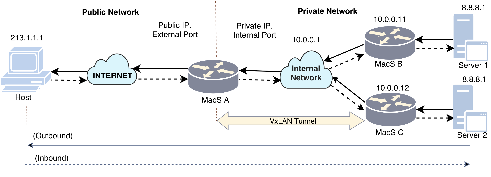

# Description

This folder contains P4 programs using version 14. In this folder we solve the following use cases:

- l2_fwd: One of the most simple tests in P4, it considers a simple switch connected to hosts. The objective of this test is to test a simple layer two connection.

  

- l3_fwd_ipv4: Considering a layer higher than the usecase described before, this program simulates a layer three connection, using lpm implementation. Furthermore, it should be highlighted that this P4 program was specifically made for IPv4 implementation.

- l3_fwd_ipv6: Similar to the usecase before. However, in this case, using IPv6.

  

- Data Center Gateway (DCG): More complex than the others P4 program, the DCG aims to allow severs redundancy in a large data center allowing to take advantage of VxLAN features, such as: extending broadcast domain, allowing same MAC and IP (with different VNI), etc.

  

- Network address translation (NAT): It remaps one IP address space into another by modifying the IP Headers. It enables the hosts inside a private network to mask their identity behind the NAT router. And it also allows the network administrators to implement security measures to protect the private network.