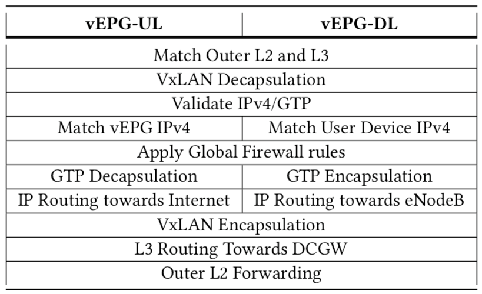
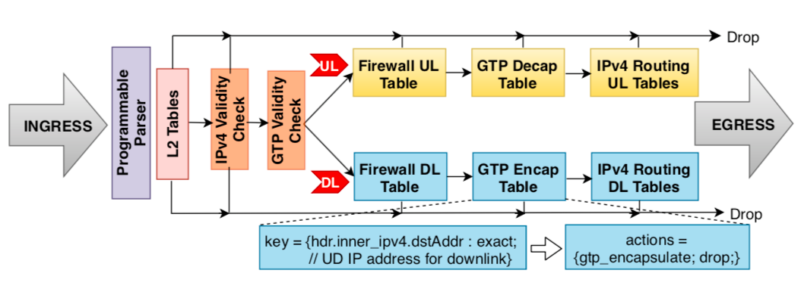
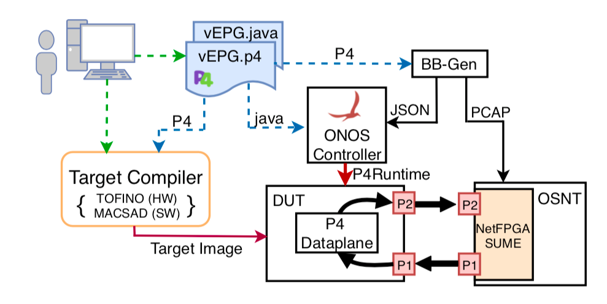

# TNA Version vEPG Code

This directory hosts P4 implementation of virtual Evolved Packet Gateway (vEPG) running on the Barefoot Tofino programmable switch.
User Plane Functions of vEPG Uplink (vEPG-UL) and vEPG Downlink (vEPG-DL) are shown in given figure below:

 

## vEPG Pipeline:

 


## Description:

vEPG_TNA folder contains two sub-folders: vEPG_P4_TNA and vEPG_Optimization_P4_TNA.
Inside vEPG_P4_TNA, you can get the complete TNA P4 code for vEPG-UL and vEPG-DL which we used for performance evaluation. vEPG_Optimization_P4_TNA is used for optimization. In the optimization code, the user device IP lookup is performed with an action to set the TEID and destination IP (i.e. eNB address) for downlink sessions, whereas the remaining actions are executed independently. Under this arrangement, the GTP Encap table becomes narrower and can scale up to 850k UDs.

## Testbed:

Figure shows the testbed featuring Open Source Network Tester (OSNT) as the traffic generator using NetFPGA-SUME with 10G SFP+ interfaces connected to the device under test (DUT), in our case (1) Edgecore Wedge 100BF-32X with Barefoot Tofino ASIC5, or (2) x86 server with Intel Xeon D-1518 processor (4 CPU cores, Cache 6M, 2,20 GHz) for the vEPG application generated by the MACSAD compiler for ODP-DPDK x86 targets.

 

## Compiling:

To compile, run p4c vEPG_TNA/vEPG_P4_TNA/vEPG_UL/vEPG.p4 for UL and p4c vEPG_TNA/vEPG_P4_TNA/vEPG_DL/vEPG.p4 for DL. We tested with SDE version 8.9.0 and ONOS version 2.1.0. 

## Citing

For detail, you can find our paper <a href="https://dl.acm.org/doi/10.1145/3359993.3366645">here</a>, please If you find this implementation or the discussions in our paper useful, please consider citing:

```

Suneet Kumar Singh, Christian Esteve Rothenberg, Gyanesh Patra, and Gergely Pongracz. 2019. Offloading Virtual Evolved Packet Gateway User Plane Functions to a Programmable ASIC. In Proceedings of the 1st ACM CoNEXT Workshop on Emerging in-Network Computing Paradigms (ENCP '19). Association for Computing Machinery, New York, NY, USA, 9–14. DOI:https://doi.org/10.1145/3359993.3366645

```


